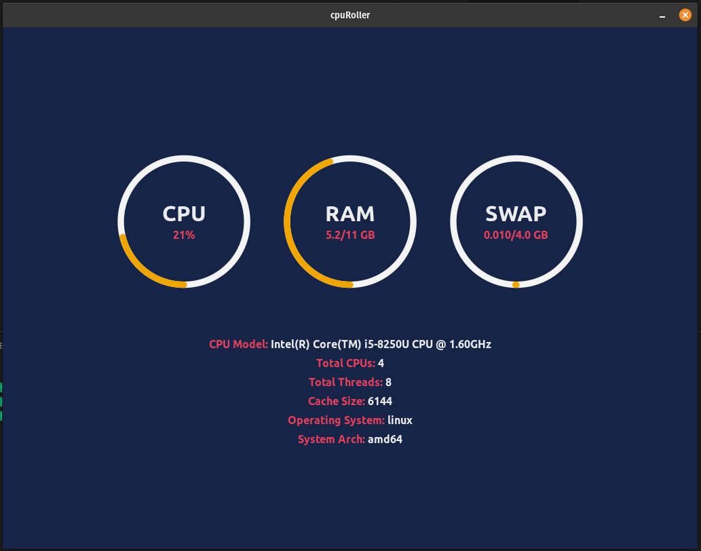

# CpuRoller (mini project)

 

## What it does

A simple Desktop application that shows realtime CPU usage of your machine. Uses React as frontend and Go lang as it's backend to achieving this.

 

## Uses

- [Wails](https://github.com/wailsapp/wails)
- [gopsutil](https://github.com/shirou/gopsutil)

 

## For Developer:

Make sure you have GO lang and npm installed
 

1. `git clone https://github.com/sarthakpranesh/CpuRoller`
2. `cd CpuRoller`
3. If you don't have Wails then install it `go get -u github.com/wailsapp/wails/cmd/wails`
4. `wails serve` - leave the command running and open another terminal
5. `cd frontend`
6. `yarn install`
7. `yarn start`

 

## Compile/Build/Package app

1. Compile application using `wails build`
2. Run application `./build/cpuRoller`

 

## Found Something Broken

If you find something broken or not working on your machine/os, please feel free to open an issue.

 

##### Made with ❤️

