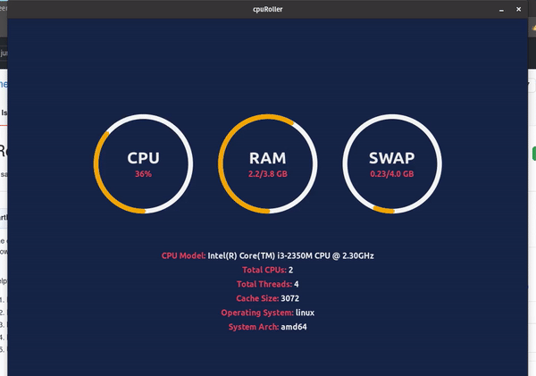

<div align="center">

# Cpu Roller

[](https://github.com/sarthakpranesh/CpuRoller/issues)
[](https://github.com/sarthakpranesh/CpuRoller/pulls)
[]()
[](https://github.com/sarthakpranesh/CpuRoller/releases)
[](https://github.com/sarthakpranesh/CpuRoller/blob/master/LICENSE)

<br />



</div>

<br />

## What it does

Simple Cross platform Desktop application for displaying realtime CPU usage of your Desktop/Laptop. Available for Linux and MacOS. Utilizes React.js frontend and Go lang backend, developed with Wails.

<br />

## How to Install
This app is currently supported in MacOS and Debian based linux distribution like Ubuntu.

### Ubuntu/POP OS/Other Debian distros
Download the latest `.deb` file from release of the application and either use `Eddy` (or any other GUI tool) to install the `.deb` package or run the following in the terminal (make sure you replace the `x.x.x` with the version number you downloaded)
```bash
sudo dpkg -i cpuRoller_x.x.x_amd64.deb
```
Now you can either run the application by running the `cpuRoller` command in terminal or by application icon.

### Mac OS
Download the latest `.app.zip` file from release. Extract this file, right click on it and select `open` from the menu. Give it permission to run and the app will start

All releases also provide binary executables, if you have any issues you can try running these executables directly.

<br />


## For Developer
Make sure you have GO lang, npm and wails installed. First `fork` this repository, `clone` it locally and `cd` into it.

### For Active Development
The following commands will let you use the standard `React` tools and development process to build the app. If you change any GO code then you'll have to rerun the 1st step for the change to take affect.
1. Run this command in the root of the project and leave it running: `wails serve`
2. Open another terminal and navigate to the frontend folder: `cd frontend`
3. Make sure all packages are installed: `npm install`
4. Start the app: `npm run start`

<br />

### Building and Packaging

#### For Debian:
1. First Build app binary using: `wails build`
2. Then Package app using: `bash ./debian-build.sh`

#### For Mac OS:
* Just run the following on a Mac: `wails build -p`

I don't have a Mac so I use cross compilation to package Mac apps using the following 
* Run the following on Linux with Docker installed: `wails build -x darwin/amd64 -p`

<br/>

## Found Something Broken

If you find something broken or not working on your machine/os, please feel free to open an issue.

<br />

<div align="center">

##### Made with ❤️

</div>
